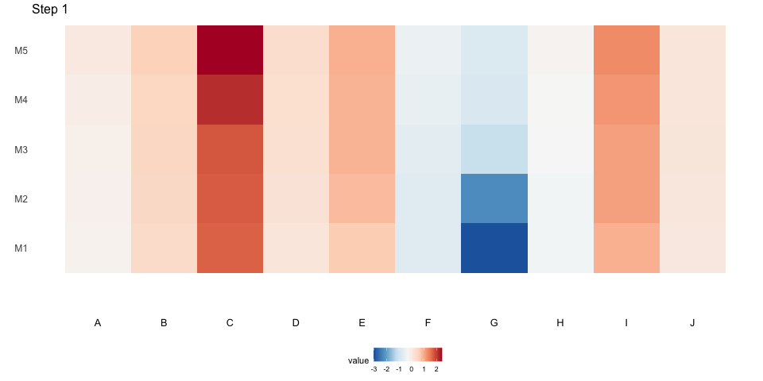

# hclust_animation

Hierarchical clustering animated through pair swaps of elements from an initial
state *Q* to a final state *P* (determined from the order of the leaves in the
hierarchical clustering dendrogram).  

For example, if *Q = ('A', 'B', 'C', 'D')* and *P = ('C', 'A', 'D', 'B')* then
we have the following swaps

```
Q = ('A', 'B', 'C', 'D')        [swap: 'A' <-> 'C']
    ('C', 'B', 'A', 'D')        [swap: 'B' <-> 'A']
    ('C', 'A', 'B', 'D')        [swap: 'B' <-> 'D']
    ('C', 'A', 'D', 'B') = P
```


